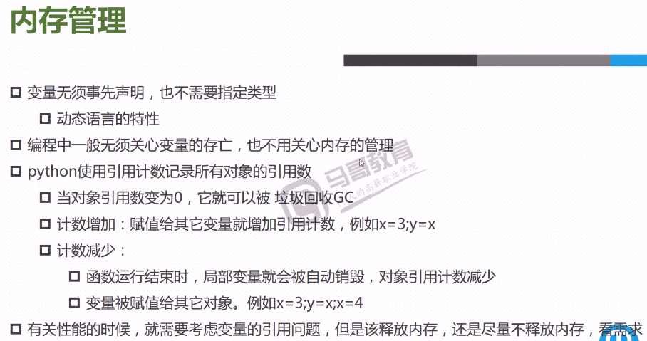

#### 程序控制
##### 內存管理和分支語句
```bash
順序
分支
循環

单分支结果
if语句
    if condition:
       代码块
       condition必须是一个bool类型
       
#### 真值表
对象/常量      值
""            假
"string"      真
0             假
>=1           真
<=1           真
()空元组       假
[]空列表       假
{}空字典       假
None          假

多分支结果
if... elif...else

#while循环：
#for循环：
continue 跳出当前循环，如果条件满足进入下个循环
break 终止当前(离自己最近的)选好
总结：
continue和break是循环的控制语句，只影响当前循环，如for,while
如果循环嵌套，continue和break也只影响语句所在的那一层循环
continue,break不是跳出语句块，所以if cond: break不是跳出if,而是终止if外的break所在的循环

#else语句
while True:
    block
else:
    block
    
for i in x:
    block
else:
    block
如果循环正常结束，就执行else子句；如果使用break终止，else不会执行
```
