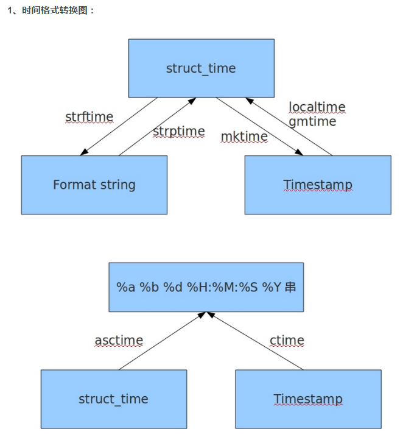

参照：https://www.cnblogs.com/lichunl/p/9098024.html
#### 一、time模块
    time 模块中时间表现的格式主要有三种：
    a、timestamp时间戳，时间戳表示从1970年1月1日00:00:00开始按秒计算的偏移量
    b、struct_time时间元组，共有九个元素组
    c、format time格式化时间，已格式化的结构式时间具有可读性

#### 二、datetime模块
